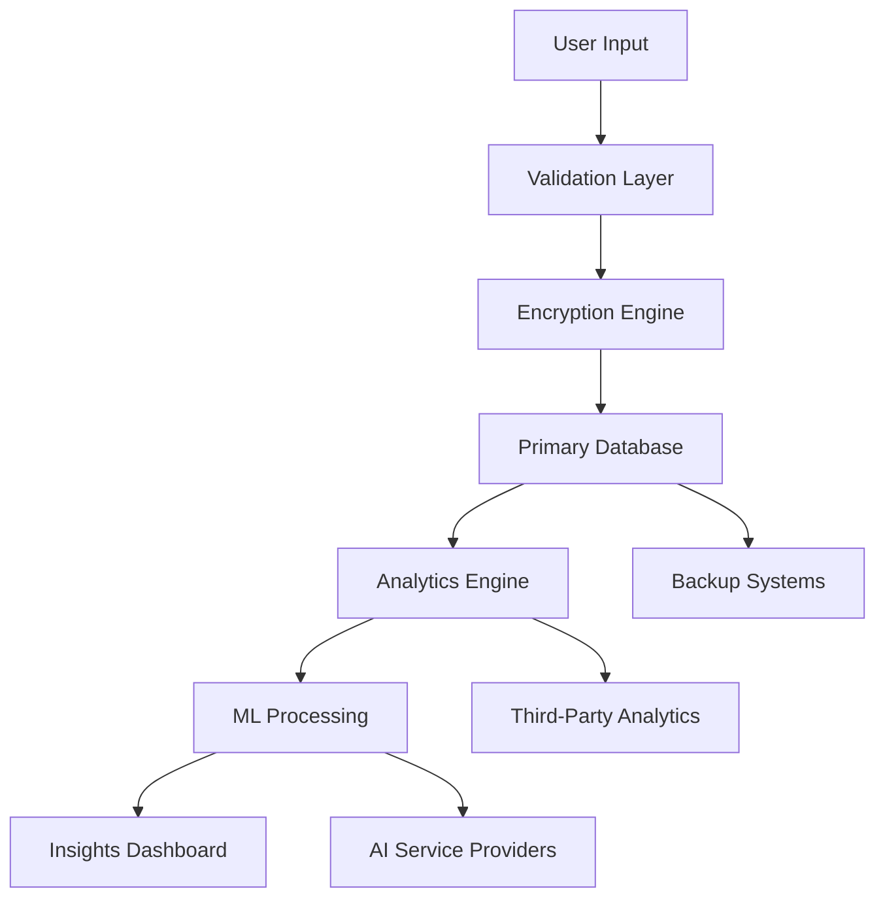

# 🔄 FinFlow – Data Handling Overview

**Document Version**: 1.0  
**Last Updated**: July 2025  
**Classification**: Internal/Confidential

---

## 📊 Types of Data We Process

### 1. **Personally Identifiable Information (PII)**
| Data Category | Examples | Legal Basis | Sensitivity Level |
|---------------|----------|-------------|-------------------|
| **Identity Data** | Name, ID number, passport | Contract | 🔴 High |
| **Contact Data** | Email, phone, address | Contract | 🟡 Medium |
| **Financial Data** | Bank accounts, credit cards | Contract | 🔴 Critical |
| **Authentication** | Passwords (hashed), 2FA | Security | 🔴 Critical |

### 2. **Behavioral Analytics Data**
| Data Type | Collection Method | Purpose | Retention |
|-----------|------------------|---------|-----------|
| **Page Views** | Web analytics | UX improvement | 6 months |
| **Click Patterns** | Heat maps | Interface optimization | 3 months |
| **Session Duration** | Time tracking | Engagement analysis | 6 months |
| **Feature Usage** | Event logging | Product development | 12 months |

### 3. **Transactional Records**
| Transaction Type | Data Points | Regulatory Requirement | Storage Period |
|------------------|-------------|------------------------|----------------|
| **Payment Records** | Amount, date, method | PCI-DSS, Tax law | 7 years |
| **Account Changes** | Modifications log | Audit trail | 5 years |
| **Access Logs** | Login attempts, IP | Security monitoring | 2 years |
| **API Calls** | Requests, responses | System integrity | 1 year |

---

## 🎯 Purpose of Data Processing

### Primary Business Functions:
1. **Service Optimization**
   - Performance monitoring and improvement
   - Bug detection and resolution
   - Feature usage analysis
   - System capacity planning

2. **Personalized Recommendations**
   - AI-powered financial insights
   - Customized dashboard layouts
   - Targeted feature suggestions
   - Smart categorization of expenses

3. **Fraud Prevention & Security**
   - Anomaly detection algorithms
   - Risk assessment scoring
   - Behavioral pattern analysis
   - Real-time transaction monitoring

4. **Regulatory Compliance**
   - Anti-money laundering (AML) checks
   - Know Your Customer (KYC) verification
   - Financial reporting requirements
   - Data protection compliance

---

## 🔒 Storage & Security Architecture

### Data at Rest (Storage Security):
```
┌─────────────────────────────────────────┐
│              APPLICATION LAYER           │
├─────────────────────────────────────────┤
│         🔐 AES-256 ENCRYPTION           │
├─────────────────────────────────────────┤
│          DATABASE LAYER (MySQL)         │
├─────────────────────────────────────────┤
│      🛡️ ACCESS CONTROL & AUDITING      │
├─────────────────────────────────────────┤
│        INFRASTRUCTURE (AWS/GCP)         │
└─────────────────────────────────────────┘
```

### Data in Transit (Transfer Security):
- **TLS 1.3** for all HTTPS connections
- **Certificate Pinning** for mobile apps
- **HSTS** with preload for web browsers
- **Perfect Forward Secrecy** (PFS) support

### Key Management:
- **AWS KMS** for encryption key management
- **Key rotation** every 90 days
- **Hardware Security Modules** (HSM) for key storage
- **Multi-factor authentication** for key access

---

## ⏰ Data Retention Policy

### Automated Retention Schedule:
```python
# Example retention configuration
RETENTION_POLICIES = {
    'user_personal_data': {
        'active_user': '12_months_after_last_activity',
        'deleted_account': '30_days_grace_period',
        'backup_copies': '90_days_maximum'
    },
    'financial_records': {
        'transaction_logs': '7_years',  # Legal requirement
        'payment_methods': '3_years_after_last_use',
        'tax_documents': '7_years'
    },
    'security_logs': {
        'access_logs': '24_months',
        'authentication_logs': '12_months',
        'audit_trails': '5_years'
    },
    'analytics_data': {
        'aggregated_metrics': '36_months',
        'individual_sessions': '6_months',
        'ab_test_data': '12_months'
    }
}
```

### Data Deletion Process:
1. **Soft Delete**: Mark as deleted, 30-day recovery period
2. **Hard Delete**: Permanent removal from active systems
3. **Backup Purge**: Remove from all backup systems
4. **Audit Log**: Record deletion with timestamp and reason

---

## 🌐 Data Flow & Third-Party Integrations

### Data Processing Pipeline:


### Approved Third-Party Processors:
| Service Provider | Data Types | Purpose | Compliance Status |
|------------------|------------|---------|-------------------|
| **AWS** | All categories | Cloud infrastructure | ✅ GDPR, SOC 2 |
| **Stripe** | Payment data | Transaction processing | ✅ PCI-DSS Level 1 |
| **SendGrid** | Email addresses | Transactional emails | ✅ GDPR compliant |
| **OpenAI** | Anonymized queries | AI recommendations | ✅ Privacy policy |
| **Google Analytics** | Usage metrics | Website analytics | ✅ Data processing agreement |

---

## 📋 Regulatory Compliance Framework

### GDPR Implementation:
- ✅ **Lawful basis** documented for all processing
- ✅ **Data minimization** - collect only necessary data
- ✅ **Purpose limitation** - use data only for stated purposes
- ✅ **Storage limitation** - automated retention policies
- ✅ **Integrity & confidentiality** - encryption and access controls
- ✅ **Accountability** - comprehensive documentation

### Additional Standards:
| Standard | Scope | Implementation Status |
|----------|-------|----------------------|
| **ISO/IEC 27001** | Information security management | ✅ Implemented |
| **PCI-DSS** | Payment card data security | ✅ Level 1 certified |
| **SOC 2 Type II** | Service organization controls | ✅ Annual audit |
| **ISO/IEC 27018** | Cloud privacy protection | ✅ Implemented |

---

## 🔍 Data Subject Rights Implementation

### Automated Rights Management System:
```javascript
// Example: Data export automation
const handleDataExportRequest = async (userId) => {
  const userData = await db.users.findById(userId);
  const transactions = await db.transactions.findByUser(userId);
  const preferences = await db.preferences.findByUser(userId);
  
  const exportPackage = {
    personal_data: anonymize(userData),
    financial_data: encrypt(transactions),
    preferences: preferences,
    export_timestamp: new Date().toISOString(),
    format_version: '1.0'
  };
  
  return generateSecureDownloadLink(exportPackage);
};
```

### Rights Response Timeline:
- **Access requests**: 72 hours (automated)
- **Rectification**: 48 hours (semi-automated)
- **Erasure**: 30 days (includes backup purge)
- **Portability**: 7 days (secure download link)

---

## 🚨 Incident Response Procedures

### Data Breach Response Plan:
1. **Detection & Assessment** (0-1 hour)
   - Automated monitoring alerts
   - Security team notification
   - Initial impact assessment

2. **Containment** (1-4 hours)
   - Isolate affected systems
   - Preserve evidence
   - Stop ongoing data exposure

3. **Investigation** (4-24 hours)
   - Root cause analysis
   - Scope determination
   - Risk assessment

4. **Notification** (24-72 hours)
   - Regulatory authorities (GDPR: 72 hours)
   - Affected individuals (without undue delay)
   - Internal stakeholders

5. **Recovery & Lessons Learned** (Ongoing)
   - System restoration
   - Security improvements
   - Process updates

---

## 📞 Data Protection Contacts

### Internal Team:
- **Data Protection Officer (DPO)**: dpo@finflow.co.il
- **Security Team Lead**: security@finflow.co.il
- **Compliance Manager**: compliance@finflow.co.il
- **Engineering Lead**: engineering@finflow.co.il

### External Contacts:
- **Legal Counsel**: [External law firm]
- **Penetration Testing**: [Security audit firm]
- **Privacy Consultant**: [Privacy advisory firm]
- **Insurance Provider**: [Cyber liability insurance]

---

## 📈 Continuous Improvement

### Regular Reviews:
- **Monthly**: Access logs and security metrics
- **Quarterly**: Retention policy effectiveness
- **Semi-annually**: Third-party processor assessments
- **Annually**: Complete privacy impact assessment

### Metrics & KPIs:
- Data minimization ratio
- Rights request response time
- Security incident frequency
- Compliance audit scores
- User privacy satisfaction

---

**Document Classification**: Confidential - Internal Use Only  
**Next Review Date**: January 2026  
**Approved By**: Chief Technology Officer, Data Protection Officer

**🔐 This document contains proprietary and confidential information of FinFlow Ltd.**
